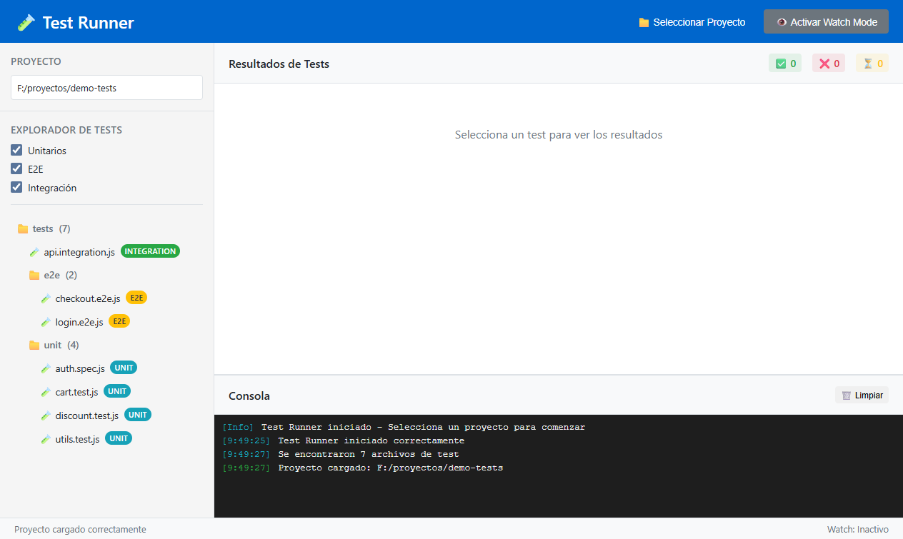
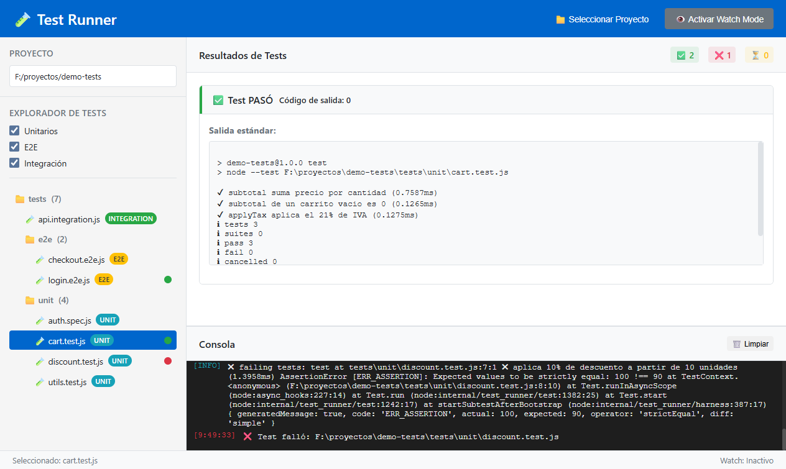

# 🧪 Test Runner - Desktop Testing Suite

<div align="center">

**Una aplicación de escritorio moderna para ejecutar y gestionar tests unitarios y E2E**

[](https://opensource.org/licenses/MIT)
[](https://electronjs.org/)
[](https://nodejs.org/)
[](https://www.ecmascript.org/)

[🌐 Web del proyecto](https://cmurestudillos.github.io/test-runner/) • [🚀 Descargar](https://github.com/cmurestudillos/test-runner/releases) • [📖 Documentación](#-características) • [🐛 Reportar Bug](https://github.com/cmurestudillos/test-runner/issues) • [💡 Solicitar Feature](https://github.com/cmurestudillos/test-runner/issues)

</div>

---

## ✨ **Características**

### 🎯 **Core Features**
- **🔍 Explorador Inteligente**: Detecta automáticamente archivos de test en tu proyecto
- **⚡ Ejecución Rápida**: Ejecuta tests individuales o por grupos con un clic
- **👁️ Watch Mode**: Monitoreo automático de cambios en archivos
- **📊 Resultados en Tiempo Real**: Visualización de resultados mientras se ejecutan
- **🎨 Interfaz Moderna**: Diseño limpio e intuitivo

### 🧪 **Soporte Multi-Framework**
- **Jest** - Tests unitarios y de integración
- **Mocha** - Framework de testing flexible
- **Cypress** - Tests E2E modernos
- **Playwright** - Tests cross-browser
- **Vitest** - Testing ultrarrápido para Vite
- **Y más...** - Compatible con cualquier runner de tests

### 🎛️ **Gestión Avanzada**
- **Filtros Inteligentes**: Por tipo (unitarios, E2E, integración)
- **Consola Integrada**: Logs detallados en tiempo real  
- **Estadísticas Live**: Contadores de tests pasados/fallados/ejecutándose
- **Atajos de Teclado**: Workflow optimizado para desarrolladores
- **Organización Visual**: Estructura de carpetas clara con indicadores de estado

---

## 📸 **Capturas**

<div align="center">

| Explorador de tests                                     | Resultado de un test                                      |
| ------------------------------------------------------- | --------------------------------------------------------- |
|  |   |
| **Test fallido**                                        | **Watch mode**                                             |
|  |         |

Más capturas en la [web del proyecto](https://cmurestudillos.github.io/test-runner/#/capturas).

</div>

---

## 🚀 **Instalación**

### Prerequisitos
- Node.js 22+
- pnpm 11+
- Proyecto con tests configurados

### Clonar e instalar
```bash
git clone https://github.com/cmurestudillos/test-runner.git
cd test-runner
pnpm install
```

### Ejecutar en desarrollo
```bash
pnpm start          # Modo normal
pnpm start:dev      # Modo con DevTools abiertos
```

### Construir para distribución
```bash
pnpm package:mac      # Crear ejecutable mac
pnpm package:win      # Crear ejecutable windows
pnpm package:linux    # Crear ejecutable linux
```

---

## 📖 **Guía de Uso**

### 1️⃣ **Seleccionar Proyecto**
- Haz clic en **"📁 Seleccionar Proyecto"**
- Navega hasta el directorio raíz de tu proyecto
- La app escaneará automáticamente los archivos de test

### 2️⃣ **Ejecutar Tests**
- **Doble clic** en cualquier test para ejecutarlo
- **Enter** sobre test seleccionado
- **Watch mode** para ejecución automática

### 3️⃣ **Monitorear Resultados**
- Panel central muestra resultados detallados
- Consola inferior con logs en tiempo real
- Estadísticas actualizadas automáticamente

### 4️⃣ **Filtrar y Organizar**
- Filtros por tipo: Unitarios, E2E, Integración
- Estructura de carpetas clara
- Indicadores visuales de estado

---

## ⌨️ **Atajos de Teclado**

| Atajo | Acción |
|-------|--------|----------------------------|
| `Ctrl/Cmd + O` | Abrir proyecto             |
| `Ctrl/Cmd + W` | Toggle watch mode          |
| `Ctrl/Cmd + L` | Limpiar consola            |
| `Enter`        | Ejecutar test seleccionado |
|----------------|----------------------------|

---

## 🏗️ **Arquitectura**

```
src/
├── main.js              # Proceso principal de Electron
├── renderer.js          # Lógica de la interfaz de usuario
├── preload.js           # Comunicación segura IPC
├── index.html           # Interfaz principal
└── assets/
    └── styles/
        └── styles.css   # Estilos de la aplicación

docs/                    # Web del proyecto (GitHub Pages)
├── index.html           # SPA con router por hash
└── assets/
    ├── css/styles.css
    ├── js/app.js        # Router, galería y descargas desde la API de GitHub
    └── screenshots/     # Capturas reales de la aplicación
```

### Tecnologías utilizadas
- **Electron** - Framework de aplicaciones de escritorio
- **Node.js** - Runtime de JavaScript
- **Chokidar** - File watching para watch mode
- **fs-extra** - Operaciones avanzadas de sistema de archivos

---

## 🌐 **Web del proyecto**

La carpeta `docs/` contiene la página pública, publicada con **GitHub Pages** desde la rama `master`:
👉 [cmurestudillos.github.io/test-runner](https://cmurestudillos.github.io/test-runner/)

- SPA en HTML, CSS y JavaScript vanilla, **sin dependencias ni build**
- Vistas: Inicio, Características, Capturas, Descargas y Documentación
- Tema claro/oscuro y diseño responsive
- Los enlaces de descarga se leen en vivo de la
  [API de releases](https://api.github.com/repos/cmurestudillos/test-runner/releases/latest):
  detecta el sistema operativo del visitante y muestra nombre y tamaño reales de cada instalador,
  con respaldo a la página de releases si la API no responde

### Actualizar las capturas

Las imágenes de `docs/assets/screenshots/` son capturas reales de la aplicación, no mockups. Para
regenerarlas tras un cambio de interfaz basta con abrir un proyecto con tests, ejecutar alguno y
capturar la ventana; también puede automatizarse arrancando Electron con un script que sustituya el
handler `select-directory` por una ruta fija y use `webContents.capturePage()`.

---

## 🤝 **Contribuir**

¡Las contribuciones son bienvenidas! Aquí te explico cómo:

### 🐛 **Reportar Bugs**
1. Verifica que el bug no haya sido reportado
2. Crea un [issue](https://github.com/cmurestudillos/test-runner/issues) con:
   - Descripción detallada
   - Pasos para reproducir
   - Sistema operativo y versión
   - Capturas de pantalla (si aplica)

### ✨ **Solicitar Features**
1. Revisa las [issues existentes](https://github.com/cmurestudillos/test-runner/issues)
2. Crea una nueva issue con:
   - Descripción clara de la funcionalidad
   - Casos de uso
   - Mockups o ejemplos (opcional)

### 🔧 **Desarrollar**
1. Fork del repositorio
2. Crea una rama: `git checkout -b feature/amazing-feature`
3. Commit tus cambios: `git commit -m 'Add amazing feature'`
4. Push: `git push origin feature/amazing-feature`
5. Abre un Pull Request

### 📋 **Tareas Pendientes**
- [ ] Soporte para más frameworks de testing
- [ ] Temas personalizables (dark/light mode)
- [ ] Exportar reportes de tests
- [ ] Integración con CI/CD
- [ ] Plugin system
- [ ] Tests paralelos

---

## 📊 **Roadmap**

### v1.1.0 (Próximo)
- [ ] Dark mode / Light mode
- [ ] Exportar reportes HTML/PDF
- [ ] Soporte para Jest coverage
- [ ] Configuración persistente

### v1.2.0 (Futuro)
- [ ] Plugin system
- [ ] Integración con GitHub Actions
- [ ] Tests paralelos
- [ ] Comparación de rendimiento

### v2.0.0 (Visión)
- [ ] Editor de tests integrado
- [ ] Debugging visual
- [ ] Colaboración en tiempo real
- [ ] Cloud sync

---

## 📄 **Licencia**

Este proyecto está licenciado bajo la Licencia MIT - ver el archivo [LICENSE](LICENSE) para detalles.

---

## 👨‍💻 **Autor**

**Carlos Mur** - *Creador y Mantenedor Principal*
- 🐙 GitHub: [@cmurestudillos](https://github.com/cmurestudillos)

---

## 🙏 **Agradecimientos**

- [Electron.js](https://electronjs.org/) por el excelente framework
- [Chokidar](https://github.com/paulmillr/chokidar) por el file watching
- La comunidad de testing de JavaScript
- Todos los contribuidores y testers beta

---

## 📈 **Stats**

<div align="center">


</div>

---

<div align="center">

**¿Te gusta el proyecto? ¡Dale una ⭐ en GitHub!**

</div>